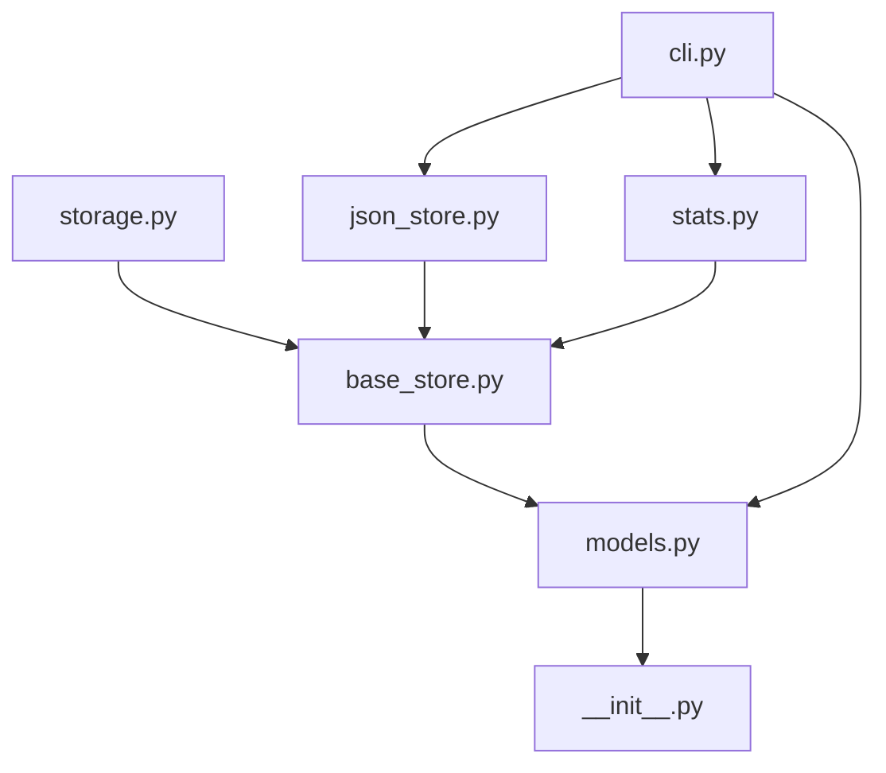

# 模块详解

本文档详细介绍 TaskManager 系统各个模块的职责、关键类和依赖关系。

## 模块结构

```
task_manager/
├── __init__.py          # 包初始化，版本定义
├── models.py            # 数据模型定义
├── base_store.py        # 存储抽象接口
├── storage.py           # 内存存储实现
├── json_store.py        # JSON存储实现
├── cli.py               # 命令行界面
└── stats.py             # 统计分析模块
```

## 核心模块

### 1. models.py - 数据模型层

**职责：** 定义任务相关的数据结构和业务逻辑。

#### 核心类

##### TaskStatus (枚举)
```python
class TaskStatus(Enum):
    TODO = "todo"
    IN_PROGRESS = "in_progress" 
    DONE = "done"
    CANCELLED = "cancelled"
```

##### Priority (枚举)
```python
class Priority(Enum):
    LOW = 1
    MEDIUM = 2
    HIGH = 3
    CRITICAL = 4
```

##### SubTask (数据类)
```python
@dataclass
class SubTask:
    title: str
    done: bool = False
    subtask_id: str = field(default_factory=lambda: uuid4().hex[:6])
```
- **用途：** 表示任务的子项
- **关键方法：** `complete()` - 标记完成

##### Task (数据类)
```python
@dataclass
class Task:
    title: str
    description: str = ""
    status: TaskStatus = TaskStatus.TODO
    priority: Priority = Priority.MEDIUM
    assignee: Optional[str] = None
    tags: list[str] = field(default_factory=list)
    subtasks: list[SubTask] = field(default_factory=list)
    due_date: Optional[datetime] = None
    created_at: datetime = field(default_factory=datetime.now)
    updated_at: datetime = field(default_factory=datetime.now)
    task_id: str = field(default_factory=lambda: uuid4().hex[:8])
```

**关键方法：**
- `mark_done()` - 标记任务完成
- `cancel()` - 取消任务
- `start()` - 开始任务
- `assign_to(user)` - 分配给用户
- `add_subtask(title)` - 添加子任务
- `to_dict()` / `from_dict()` - 序列化/反序列化

**属性：**
- `progress` - 基于子任务的完成进度
- `is_overdue` - 是否逾期

**依赖：** datetime, uuid, dataclasses, enum

### 2. base_store.py - 存储抽象层

**职责：** 定义存储接口规范，实现存储层解耦。

#### 核心类

##### BaseTaskStore (抽象基类)
```python
class BaseTaskStore(ABC):
    @abstractmethod
    def add(self, task: Task) -> str: ...
    @abstractmethod
    def get(self, task_id: str) -> Optional[Task]: ...
    @abstractmethod
    def update(self, task: Task) -> None: ...
    @abstractmethod
    def remove(self, task_id: str) -> bool: ...
    @abstractmethod
    def list_all(self) -> list[Task]: ...
    @abstractmethod
    def filter_by_status(self, status: TaskStatus) -> list[Task]: ...
    @abstractmethod
    def filter_by_assignee(self, assignee: str) -> list[Task]: ...
    @abstractmethod
    def search(self, keyword: str) -> list[Task]: ...
    @property
    @abstractmethod
    def count(self) -> int: ...
```

**设计目的：**
- 定义统一的存储接口
- 支持多种存储实现
- 便于单元测试

**依赖：** abc, models

### 3. storage.py - 内存存储实现

**职责：** 提供基于内存的非持久化存储实现。

#### 核心类

##### MemoryStore
```python
class MemoryStore(BaseTaskStore):
    def __init__(self) -> None:
        self._tasks: dict[str, Task] = {}
```

**特点：**
- 数据存储在内存中，进程结束后丢失
- 查询性能优秀
- 适用于测试和临时使用

**实现细节：**
- 使用字典存储任务，以 task_id 为键
- `list_all()` 按优先级降序排列
- `search()` 对标题和描述进行大小写不敏感搜索

**依赖：** base_store, models

### 4. json_store.py - JSON持久化存储

**职责：** 提供基于JSON文件的持久化存储实现。

#### 核心类

##### JsonStore
```python
class JsonStore(BaseTaskStore):
    def __init__(self, file_path: str = "tasks.json") -> None:
        self._path = Path(file_path)
        self._tasks: dict[str, Task] = {}
        self._load()
```

**关键方法：**
- `_load()` - 从JSON文件加载任务数据
- `_save()` - 将任务数据保存到JSON文件

**特点：**
- 数据持久化到本地JSON文件
- 自动处理文件不存在的情况
- UTF-8编码，支持中文
- 每次修改都会触发保存

**文件格式：** 任务对象数组的JSON格式

**依赖：** json, pathlib, base_store, models

### 5. cli.py - 命令行接口

**职责：** 提供用户命令行交互界面，处理参数解析和命令分发。

#### 核心函数

##### 命令处理器
- `cmd_add(store, args)` - 处理任务创建
- `cmd_list(store, args)` - 处理任务列表和筛选
- `cmd_done(store, args)` - 处理任务完成
- `cmd_search(store, args)` - 处理关键词搜索
- `cmd_stats(store, args)` - 处理统计信息
- `cmd_remove(store, args)` - 处理任务删除

##### 辅助函数
- `_get_store()` - 创建存储实例（默认JsonStore）
- `build_parser()` - 构建参数解析器
- `main()` - 程序入口点

#### 命令支持

| 命令 | 功能 | 参数 |
|------|------|------|
| add | 添加任务 | title, -d description, -p priority, -a assignee |
| list | 列表任务 | -s status, -a assignee |
| done | 完成任务 | task_id |
| search | 搜索任务 | keyword |
| stats | 统计信息 | 无 |
| remove | 删除任务 | task_id |

**依赖：** argparse, sys, models, base_store, json_store, stats

### 6. stats.py - 统计分析模块

**职责：** 提供任务统计分析和报表功能。

#### 核心函数

##### summary(store: BaseTaskStore) -> dict
生成任务统计摘要：
```python
{
    "total": 总任务数,
    "by_status": {状态: 数量},
    "by_priority": {优先级: 数量}, 
    "overdue_count": 逾期任务数,
    "completion_rate": 完成率
}
```

##### format_summary(stats: dict) -> str
将统计数据格式化为可读的字符串。

**特点：**
- 支持按状态和优先级分组统计
- 计算任务完成率
- 识别逾期任务
- 生成格式化报表

**依赖：** collections.Counter, base_store, models

### 7. __init__.py - 包初始化

**职责：** 定义包的基本信息和版本号。

```python
"""TaskManager — 一个任务管理系统，支持持久化存储和统计分析。"""

__version__ = "0.2.0"
```

## 模块依赖关系



## 设计模式

### 1. 抽象工厂模式
- `BaseTaskStore` 定义存储接口
- 多个具体实现：`MemoryStore`、`JsonStore`

### 2. 命令模式
- CLI命令处理器函数
- 统一的处理器签名：`(store, args) -> None`

### 3. 策略模式
- 不同存储策略的切换
- 通过依赖注入选择存储实现

## 扩展指南

### 添加新存储后端
1. 继承 `BaseTaskStore`
2. 实现所有抽象方法
3. 在 `cli.py` 的 `_get_store()` 中添加选择逻辑

### 添加新CLI命令
1. 在 `cli.py` 中定义 `cmd_xxx()` 函数
2. 在 `build_parser()` 中添加子命令
3. 在 `main()` 的处理器字典中注册

### 扩展Task模型
1. 在 `Task` 类中添加新字段
2. 更新 `to_dict()`/`from_dict()` 方法
3. 考虑向后兼容性

## 相关文档

- [架构总览](overview.md)
- [API 参考](../api/reference.md)
- [快速开始](../guide/getting-started.md)