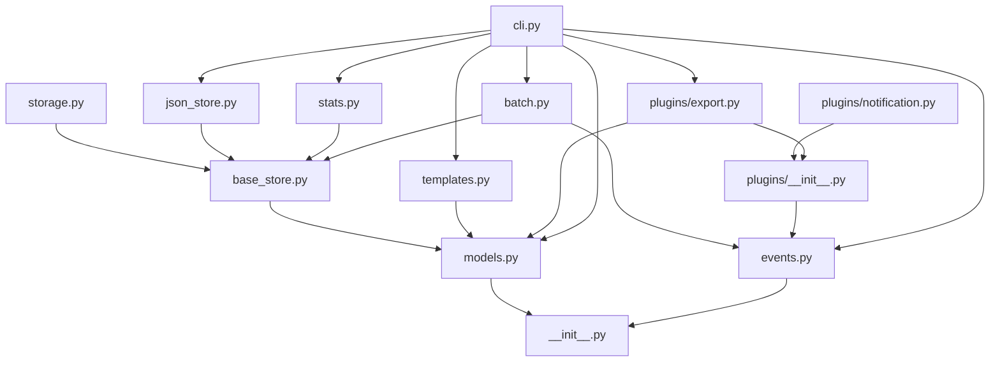

# 模块详解

本文档详细介绍 TaskManager v0.3.0 系统各个模块的职责、关键类和依赖关系。

## 模块结构

```
task_manager/
├── __init__.py          # 包初始化，版本定义（v0.3.0）
├── models.py            # 数据模型定义
├── base_store.py        # 存储抽象接口
├── storage.py           # 内存存储实现
├── json_store.py        # JSON存储实现
├── events.py            # 事件系统核心（新增）
├── templates.py         # 任务模板引擎（新增）
├── batch.py             # 批量操作模块（新增）
├── cli.py               # 命令行界面（大幅增强）
├── stats.py             # 统计分析模块
└── plugins/             # 插件系统（新增）
    ├── __init__.py      # 插件基类和注册表
    ├── notification.py  # 通知插件
    └── export.py        # 导出插件
```

## 核心模块

### 1. models.py - 数据模型层（增强）

**职责：** 定义任务相关的数据结构和业务逻辑。

#### 主要变更

- `Task` 类新增 `tags` 字段支持标签系统
- 其他核心功能保持不变

##### Task (数据类) - 更新
```python
@dataclass
class Task:
    title: str
    description: str = ""
    status: TaskStatus = TaskStatus.TODO
    priority: Priority = Priority.MEDIUM
    assignee: Optional[str] = None
    tags: list[str] = field(default_factory=list)  # 新增标签支持
    subtasks: list[SubTask] = field(default_factory=list)
    due_date: Optional[datetime] = None
    created_at: datetime = field(default_factory=datetime.now)
    updated_at: datetime = field(default_factory=datetime.now)
    task_id: str = field(default_factory=lambda: uuid4().hex[:8])
```

**依赖：** datetime, uuid, dataclasses, enum

### 2. events.py - 事件系统核心（新增）

**职责：** 实现事件驱动架构，支持组件间解耦通信。

#### 核心类

##### EventType (枚举)
```python
class EventType(Enum):
    TASK_CREATED = "task_created"
    TASK_UPDATED = "task_updated"
    TASK_COMPLETED = "task_completed"
    TASK_CANCELLED = "task_cancelled"
    TASK_DELETED = "task_deleted"
    TASK_ASSIGNED = "task_assigned"
    TASK_OVERDUE = "task_overdue"
    SUBTASK_ADDED = "subtask_added"
    SUBTASK_COMPLETED = "subtask_completed"
    BATCH_IMPORT = "batch_import"
    BATCH_EXPORT = "batch_export"
```

##### Event (数据类)
```python
@dataclass
class Event:
    event_type: EventType
    timestamp: datetime = field(default_factory=datetime.now)
    task_id: Optional[str] = None
    payload: dict[str, Any] = field(default_factory=dict)
```

##### EventBus (核心类)
```python
class EventBus:
    def subscribe(self, event_type: Optional[EventType], handler: EventHandler)
    def unsubscribe(self, event_type: Optional[EventType], handler: EventHandler)
    def emit(self, event: Event)
    def get_history(self, event_type: Optional[EventType], limit: int) -> list[Event]
    def clear_history()
```

**特点：**
- 支持类型化事件订阅和通配符监听（传入 None）
- 同步事件分发，错误隔离
- 事件历史记录（最多1000条）
- 全局单例模式

**依赖：** logging, dataclasses, datetime, enum, typing

### 3. templates.py - 任务模板引擎（新增）

**职责：** 提供可复用的任务蓝图，支持变量插值。

#### 核心类

##### TaskTemplate (数据类)
```python
@dataclass
class TaskTemplate:
    name: str
    title_pattern: str
    description_pattern: str = ""
    default_priority: Priority = Priority.MEDIUM
    default_tags: list[str] = field(default_factory=list)
    subtask_titles: list[str] = field(default_factory=list)
    variables: dict[str, str] = field(default_factory=dict)
```

**关键方法：**
- `render(overrides: dict[str, str]) -> Task` - 生成任务实例
- `to_dict()` / `from_dict()` - 序列化支持

##### TemplateRegistry (管理类)
```python
class TemplateRegistry:
    def __init__(self, file_path: Optional[str] = None)
    def add(self, template: TaskTemplate)
    def get(self, name: str) -> Optional[TaskTemplate]
    def remove(self, name: str) -> bool
    def list_all() -> list[TaskTemplate]
    @staticmethod
    def builtin_templates() -> list[TaskTemplate]
```

**内置模板：**
- `bug-fix` - Bug修复工作流（5个子任务）
- `feature` - 功能开发模板（5个子任务）
- `release` - 版本发布检查清单（8个子任务）

**依赖：** json, pathlib, dataclasses, models

### 4. batch.py - 批量操作模块（新增）

**职责：** 提供批量任务操作、导入导出和重复检测功能。

#### 核心类

##### BatchOperations
```python
class BatchOperations:
    def __init__(self, store: BaseTaskStore)
    
    # 导入导出
    def import_from_json(self, file_path: str) -> list[Task]
    def export_to_json(self, file_path: str, status_filter: Optional[TaskStatus]) -> int
    
    # 批量状态变更
    def complete_all(self, task_ids: Optional[list[str]]) -> int
    def cancel_all(self, task_ids: Optional[list[str]]) -> int
    def reassign_all(self, task_ids: list[str], new_assignee: str) -> int
    
    # 重复检测
    def find_duplicates(self, threshold: float = 0.8) -> list[tuple[Task, Task]]
```

**特点：**
- 所有操作都触发相应事件
- 支持指定任务ID列表或操作全部任务
- 使用Jaccard相似度进行重复检测
- 导入时跳过重复ID的任务

**依赖：** json, pathlib, logging, base_store, events, models

### 5. plugins/ - 插件系统（新增）

#### plugins/__init__.py - 插件框架

##### PluginMeta (数据类)
```python
@dataclass
class PluginMeta:
    name: str
    version: str
    description: str
    author: str = ""
```

##### BasePlugin (抽象基类)
```python
class BasePlugin(ABC):
    def __init__(self, event_bus: EventBus, config: dict[str, Any])
    
    @property
    @abstractmethod
    def meta(self) -> PluginMeta
    
    @abstractmethod
    def activate(self)
    
    def deactivate(self)
```

##### PluginRegistry (管理类)
```python
class PluginRegistry:
    def register(self, plugin_cls: type[BasePlugin], config: dict) -> BasePlugin
    def unregister(self, name: str)
    def get(self, name: str) -> Optional[BasePlugin]
    def shutdown()
```

#### plugins/notification.py - 通知插件

```python
class NotificationPlugin(BasePlugin):
    # 监听关键事件：完成、取消、逾期、分配
    # 可选日志文件记录（JSON Lines格式）
```

**配置选项：**
- `log_file` - 日志文件路径
- `notify_events` - 要监听的事件类型列表

#### plugins/export.py - 导出插件

```python
class ExportPlugin(BasePlugin):
    def export_tasks(self, tasks: list[Task], fmt: str, output_path: str) -> str
    
    # 支持格式：JSON, CSV, Markdown
    # 监听 BATCH_EXPORT 事件
```

**支持格式：**
- `json` - 标准JSON格式
- `csv` - 包含所有字段的CSV表格
- `markdown` - 表格格式的Markdown文档

### 6. cli.py - 命令行界面（大幅增强）

**职责：** 提供用户命令行交互界面，支持新增的模板、批量、导入导出功能。

#### 新增命令组

##### 模板命令
- `template list` - 列出可用模板
- `template use <name>` - 使用模板创建任务

##### 批量命令
- `batch complete [task_ids...]` - 批量完成任务
- `batch cancel [task_ids...]` - 批量取消任务

##### 导入导出命令
- `import <file>` - 从JSON文件导入任务
- `export [-f format] [-o output]` - 导出任务到文件

##### 工具命令
- `duplicates [--threshold]` - 查找重复任务
- `history [-n limit]` - 显示事件历史
- `plugins` - 列出加载的插件

#### 增强的现有命令
- `add` 命令新增 `-t/--tags` 参数
- `list` 命令显示标签和进度信息
- 所有变更操作都触发相应事件

**依赖：** argparse, sys, json, models, base_store, json_store, events, stats, templates, batch, plugins

### 7. 保持不变的模块

以下模块功能基本保持不变：
- `base_store.py` - 存储抽象接口
- `storage.py` - 内存存储实现（重命名为MemoryStore）
- `json_store.py` - JSON文件存储
- `stats.py` - 统计分析功能

### 8. __init__.py - 包初始化（更新）

```python
"""TaskManager — 一个任务管理系统，支持持久化存储、事件系统、插件架构和批量操作。"""

__version__ = "0.3.0"
```

## 模块依赖关系



## 设计模式

### 1. 观察者模式
- `EventBus` 作为主题，插件作为观察者
- 任务状态变更自动通知所有相关插件

### 2. 模板方法模式
- `TaskTemplate.render()` 定义任务创建算法
- 变量插值和子任务生成的具体实现

### 3. 抽象工厂模式
- `BaseTaskStore` 定义存储接口
- `BasePlugin` 定义插件接口
- 多个具体实现：存储后端、功能插件

### 4. 命令模式
- CLI命令处理器函数
- 批量操作的封装

### 5. 注册表模式
- `PluginRegistry` 管理插件生命周期
- `TemplateRegistry` 管理模板存储

## 扩展指南

### 添加新插件
1. 继承 `BasePlugin`
2. 实现 `meta` 属性和 `activate()` 方法
3. 在 `activate()` 中订阅感兴趣的事件
4. 通过 `PluginRegistry.register()` 注册

### 添加新事件类型
1. 在 `EventType` 枚举中添加新值
2. 在相关业务逻辑中发出事件
3. 编写插件处理新事件

### 添加新CLI命令
1. 在 `cli.py` 中定义 `cmd_xxx()` 函数
2. 在 `build_parser()` 中添加子命令
3. 在 `main()` 的处理器字典中注册
4. 确保操作触发相应事件

### 创建自定义模板
1. 定义 `TaskTemplate` 实例
2. 通过 `TemplateRegistry.add()` 注册
3. 或保存到 `templates.json` 文件中

### 扩展批量操作
1. 在 `BatchOperations` 中添加新方法
2. 确保操作触发相应事件
3. 在CLI中添加对应命令

## 相关文档

- [架构总览](overview.md)
- [API 参考](../api/reference.md)
- [快速开始](../guide/getting-started.md)