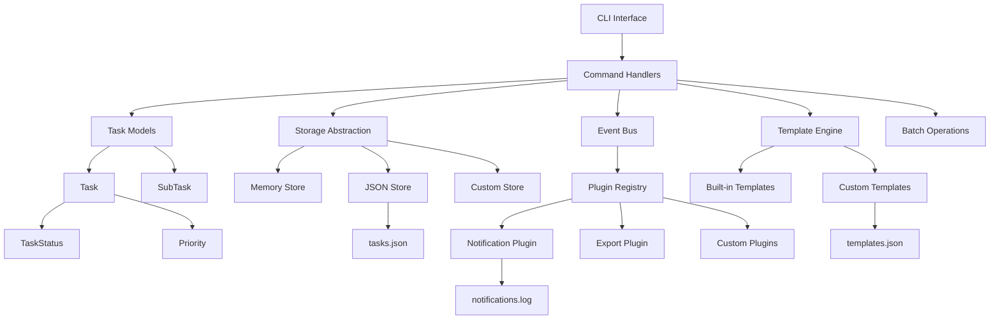

# 架构总览

本文档介绍 TaskManager v0.3.0 系统的整体架构设计、核心设计模式和技术选型。

## 系统概述

TaskManager 采用事件驱动的分层架构模式，通过抽象接口实现存储后端解耦，支持插件扩展和模板系统。系统核心围绕任务生命周期管理，提供命令行界面、事件系统和可扩展的插件架构。

## 架构图



## 核心设计原则

### 1. 事件驱动架构

- **事件总线** (`events.py`) - 中央事件调度器，支持发布/订阅模式
- **生命周期事件** - 任务创建、完成、取消、分配等关键状态变化
- **插件响应** - 插件通过监听事件实现功能扩展
- **历史追踪** - 自动记录事件历史用于审计和调试

### 2. 插件架构

- **基础插件类** (`BasePlugin`) - 定义插件生命周期和接口规范
- **插件注册表** (`PluginRegistry`) - 管理插件加载、激活和卸载
- **内置插件** - 通知插件和导出插件作为功能示例
- **扩展点** - 通过事件监听和配置注入实现功能扩展

### 3. 分层架构

- **表示层** (`cli.py`) - 命令行接口，处理用户输入和输出格式化
- **业务层** (`models.py`, `templates.py`, `batch.py`) - 任务模型、模板引擎和批量操作
- **事件层** (`events.py`) - 事件总线和生命周期管理
- **存储层** (`base_store.py`, `storage.py`, `json_store.py`) - 数据持久化抽象和实现
- **插件层** (`plugins/`) - 可扩展功能插件
- **工具层** (`stats.py`) - 统计分析和报表功能

### 4. 接口抽象

通过 `BaseTaskStore` 和 `BasePlugin` 抽象基类定义接口规范，实现：
- 存储实现与业务逻辑解耦
- 插件系统的标准化接口
- 支持多种存储后端和功能扩展
- 便于测试和模拟

## 核心组件

### 事件系统 (events.py)

```python
class EventBus:
    def subscribe(self, event_type: EventType, handler: EventHandler)
    def emit(self, event: Event)
    def get_history(self, limit: int) -> list[Event]
```

**核心特性：**
- 支持类型化事件订阅和通配符监听
- 同步事件分发和异常处理
- 事件历史记录和查询
- 全局单例模式确保一致性

### 插件系统 (plugins/)

```python
class BasePlugin(ABC):
    def activate(self) -> None
    def deactivate(self) -> None
    @property
    def meta(self) -> PluginMeta
```

**内置插件：**
- `NotificationPlugin` - 任务事件通知和日志记录
- `ExportPlugin` - 支持JSON、CSV、Markdown格式导出

### 模板引擎 (templates.py)

```python
class TaskTemplate:
    def render(self, overrides: dict[str, str]) -> Task
    
class TemplateRegistry:
    def add(self, template: TaskTemplate)
    def get(self, name: str) -> TaskTemplate
```

**内置模板：**
- `bug-fix` - Bug修复工作流模板
- `feature` - 功能开发模板
- `release` - 版本发布检查清单

### 批量操作 (batch.py)

```python
class BatchOperations:
    def import_from_json(self, file_path: str) -> list[Task]
    def export_to_json(self, file_path: str) -> int
    def complete_all(self, task_ids: list[str]) -> int
    def find_duplicates(self, threshold: float) -> list[tuple[Task, Task]]
```

**核心功能：**
- 任务批量导入导出
- 批量状态变更（完成、取消、重分配）
- 重复任务检测
- 所有操作都触发相应事件

### 任务模型 (models.py)

任务模型保持原有设计，增加了标签支持：

```python
@dataclass
class Task:
    title: str
    tags: list[str] = field(default_factory=list)
    # ... 其他字段保持不变
```

## 数据流

### 事件驱动的操作流程

1. **任务创建**
   ```
   CLI Input → cmd_add() → Task() → store.add() → Event(TASK_CREATED) → Plugin Handlers → JSON File
   ```

2. **模板使用**
   ```
   CLI Input → Template.render() → Task() → store.add() → Event(TASK_CREATED) → Plugin Notifications
   ```

3. **批量操作**
   ```
   CLI Input → BatchOperations → Multiple store operations → Multiple Events → Plugin Responses
   ```

## 扩展点

### 1. 新插件开发

继承 `BasePlugin` 实现自定义功能：
```python
class SlackPlugin(BasePlugin):
    def activate(self):
        self.bus.subscribe(EventType.TASK_COMPLETED, self._notify_slack)
```

### 2. 新事件类型

在 `EventType` 枚举中添加新事件：
```python
class EventType(Enum):
    TASK_ARCHIVED = "task_archived"
    PROJECT_CREATED = "project_created"
```

### 3. 自定义模板

通过 `TemplateRegistry` 注册自定义模板：
```python
registry = TemplateRegistry("templates.json")
registry.add(TaskTemplate(
    name="deployment",
    title_pattern="Deploy {service} to {environment}",
    # ... 更多配置
))
```

## 技术选型

| 组件 | 技术选择 | 理由 |
|------|----------|----- |
| 事件系统 | 观察者模式 + 单例 | 简单可靠，易于调试 |
| 插件架构 | 抽象基类 + 注册表 | 类型安全，运行时检查 |
| 模板引擎 | 字符串插值 | 简单直观，无额外依赖 |
| 批量操作 | 集成事件触发 | 保持系统一致性 |
| 数据模型 | dataclass + enum | 类型安全，代码简洁 |
| CLI框架 | argparse | 标准库，功能完整 |
| 存储格式 | JSON | 可读性好，跨平台兼容 |

## 性能考虑

### 事件系统性能
- 同步事件分发，适合轻量级处理
- 事件历史有容量限制（默认1000条）
- 插件异常不影响主流程

### 当前限制
- JSON文件全量加载，不适合海量数据
- 事件历史仅在内存中，重启后丢失
- 插件系统无隔离机制

### 优化方向
1. 实现异步事件处理
2. 事件持久化到文件
3. 插件沙箱和资源限制
4. 考虑SQLite等嵌入式数据库

## 相关文档

- [模块详解](modules.md)
- [API 参考](../api/reference.md)
- [技术决策](../development/tech-decisions.md)