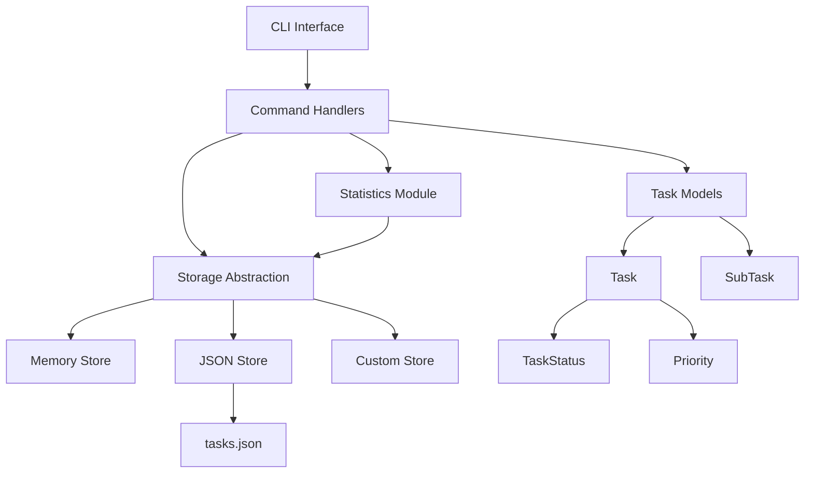

# 架构总览

本文档介绍 TaskManager 系统的整体架构设计、核心设计模式和技术选型。

## 系统概述

TaskManager 采用分层架构模式，通过抽象接口实现存储后端的解耦，支持多种持久化方案。系统核心围绕任务生命周期管理，提供命令行界面和可扩展的存储接口。

## 架构图



## 核心设计原则

### 1. 分层架构

- **表示层** (`cli.py`) - 命令行接口，处理用户输入和输出格式化
- **业务层** (`models.py`) - 任务数据模型和业务逻辑
- **存储层** (`base_store.py`, `storage.py`, `json_store.py`) - 数据持久化抽象和实现
- **工具层** (`stats.py`) - 统计分析和报表功能

### 2. 接口抽象

通过 `BaseTaskStore` 抽象基类定义存储接口规范，实现：
- 存储实现与业务逻辑解耦
- 支持多种存储后端（内存、JSON、数据库等）
- 便于测试和扩展

### 3. 数据模型驱动

使用 Python dataclass 定义结构化数据模型：
- 类型安全
- 自动生成序列化/反序列化方法
- 支持数据验证

## 核心组件

### 任务模型 (Task Model)

```python
@dataclass
class Task:
    title: str
    status: TaskStatus = TaskStatus.TODO
    priority: Priority = Priority.MEDIUM
    # ... 其他字段
```

**核心特性：**
- 支持子任务 (`SubTask`) 层级结构
- 状态生命周期管理 (TODO → IN_PROGRESS → DONE/CANCELLED)
- 优先级分级 (LOW/MEDIUM/HIGH/CRITICAL)
- 截止日期和逾期检测
- 序列化支持 (`to_dict`/`from_dict`)

### 存储抽象层

```python
class BaseTaskStore(ABC):
    @abstractmethod
    def add(self, task: Task) -> str: ...
    @abstractmethod
    def get(self, task_id: str) -> Optional[Task]: ...
    # ... 其他抽象方法
```

**实现类：**
- `MemoryStore` - 内存存储，用于测试和临时使用
- `JsonStore` - JSON文件持久化存储

### 命令处理器

每个CLI命令对应一个处理函数：
- `cmd_add()` - 创建新任务
- `cmd_list()` - 列表和筛选
- `cmd_done()` - 状态更新
- `cmd_search()` - 关键词搜索
- `cmd_stats()` - 统计报表

## 数据流

### 典型操作流程

1. **添加任务**
   ```
   CLI Input → cmd_add() → Task() → store.add() → JSON File
   ```

2. **查询任务**
   ```
   CLI Input → cmd_list() → store.filter_by_status() → Format Output
   ```

3. **更新任务**
   ```
   CLI Input → cmd_done() → task.mark_done() → store.update() → JSON File
   ```

## 扩展点

### 1. 新存储后端

继承 `BaseTaskStore` 实现自定义存储：
```python
class DatabaseStore(BaseTaskStore):
    def __init__(self, db_url: str): ...
```

### 2. 新命令

在 `cli.py` 中添加新的子命令和处理函数：
```python
def cmd_export(store: BaseTaskStore, args: argparse.Namespace):
    # 实现导出逻辑
```

### 3. 任务属性扩展

在 `Task` 模型中添加新字段：
```python
@dataclass
class Task:
    # ... 现有字段
    estimated_hours: Optional[float] = None
    project: Optional[str] = None
```

## 技术选型

| 组件 | 技术选择 | 理由 |
|------|----------|------|
| 数据模型 | dataclass + enum | 类型安全，代码简洁 |
| CLI框架 | argparse | 标准库，功能完整 |
| 存储格式 | JSON | 可读性好，跨平台兼容 |
| 日期处理 | datetime | 标准库，功能充足 |
| ID生成 | uuid4 | 全局唯一，无碰撞 |

## 性能考虑

### 当前限制
- JSON文件全量加载，不适合海量数据
- 线性搜索算法，大数据集性能不佳
- 无缓存机制，每次操作都要IO

### 优化方向
1. 实现增量加载和延迟初始化
2. 添加索引和缓存层
3. 支持分页查询
4. 考虑SQLite等嵌入式数据库

## 相关文档

- [模块详解](modules.md)
- [API 参考](../api/reference.md)
- [技术决策](../development/tech-decisions.md)